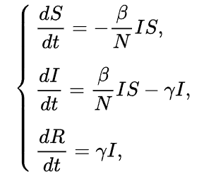
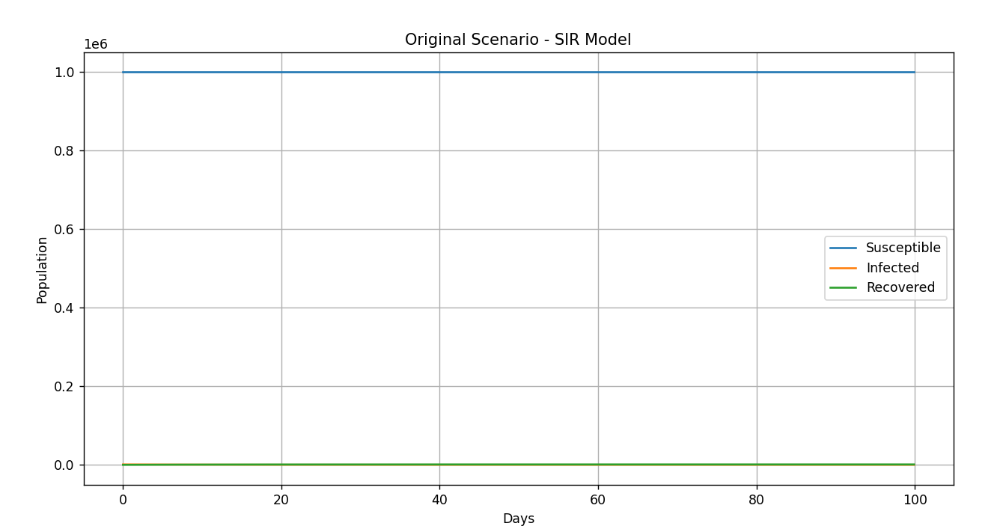
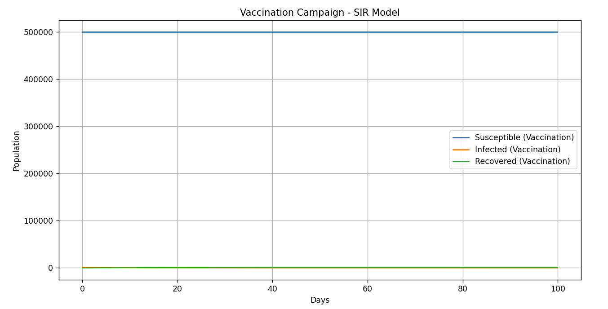
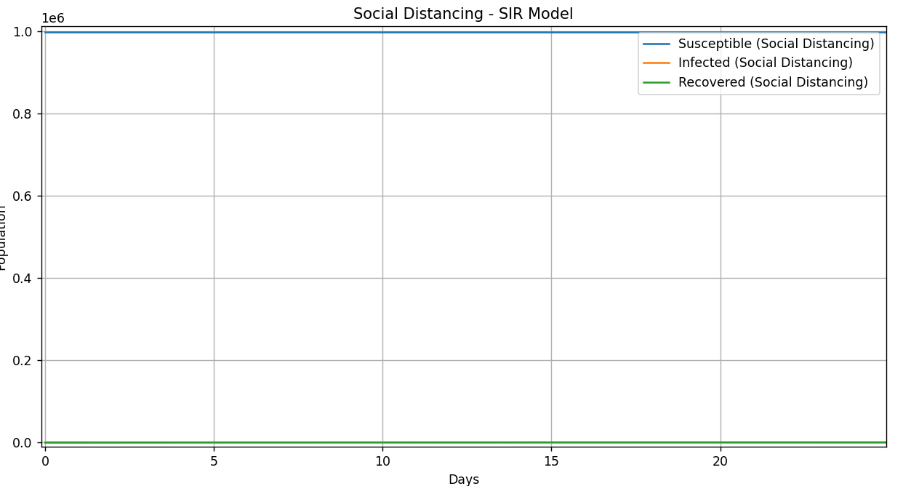

# Epidemic Simulation Report

## Overview
This project simulates the spread of an infectious disease using an SIR (Susceptible-Infectious-Recovered) model. Three scenarios are analyzed:
1. **Original Scenario:** Baseline spread of the disease without interventions.
2. **Vaccination Campaign:** 50% of the population is vaccinated at the beginning.
3. **Social Distancing:** The infection rate (β) is reduced by 50%.

The simulation is run for 100 days, and the results are analyzed and visualized.

## SIR Model Equations
The SIR model is described by a system of differential equations that govern the transitions between the compartments:



Where:
- \( S(t) \) is the number of susceptible individuals at time \( t \).
- \( I(t) \) is the number of infected individuals at time \( t \).
- \( R(t) \) is the number of recovered individuals at time \( t \).
- \( \beta \) is the **infection rate**, which determines how fast susceptible individuals become infected.
- \( \gamma \) is the **recovery rate**, which determines how fast infected individuals recover and move to the recovered compartment.

---
## Input Values

The simulation uses the following input values to define the behavior of the SIR model:

- **β (Infection Rate):** 0.0003  
- **γ (Recovery Rate):** 0.1  
- **h (Step Size):** 0.1 day  
- **Total Duration:** 100 days  

### Initial Conditions (in fractions of 1 million)
- **S0 (Initial Susceptible Population):** \(  0.999 \)  
- **I0 (Initial Infected Population):** \( 0.001 \)  
- **R0 (Initial Recovered Population):** \( 0.0 \)  


## Numerical Method
To solve the system of differential equations, the **Runge-Kutta 4th-order (RK4)** method was used. This method provides a highly accurate numerical solution for differential equations.

### Why RK4?
- RK4 is a widely used method for solving ordinary differential equations due to its balance of accuracy and computational efficiency.
- It ensures that the dynamics of the compartments \( S \), \( I \), and \( R \) are accurately captured at each step of the simulation.

---

## Graphs and Data
### Graphs (Sample Visualization)

**Graph 1: Original Scenario**  
(Graph would be here, showing S, I, and R curves for each scenario)


**Graph 2: Infection Rate by Day for Each Scenario**  
(Graph would be here, showing S, I, and R curves for each scenario)


**Graph 3: Infection Rate by Day for Each Scenario**  
(Graph would be here, showing S, I, and R curves for each scenario)


---

## Detailed Data Tables

### Original Scenario (Day-by-Day Data)
| Day  | S (Susceptible) | I (Infected) | R (Recovered) |
|------|-----------------|--------------|---------------|
| 1.0  | 0.999000        | 0.000905     | 0.000096      |
| 2.0  | 0.998999        | 0.000819     | 0.000183      |
| ...  | ...             | ...          | ...           |
| 99.0 | 0.998997        | 0.000000     | 0.001013      |

### Vaccination Campaign (Day-by-Day Data)
| Day  | S (Susceptible) | I (Infected) | R (Recovered) |
|------|-----------------|--------------|---------------|
| 1.0  | 0.499500        | 0.000905     | 0.000096      |
| 2.0  | 0.499500        | 0.000819     | 0.000183      |
| ...  | ...             | ...          | ...           |
| 99.0 | 0.499498        | 0.000000     | 0.001012      |

### Social Distancing (Day-by-Day Data)
| Day  | S (Susceptible) | I (Infected) | R (Recovered) |
|------|-----------------|--------------|---------------|
| 1.0  | 0.999000        | 0.000905     | 0.000096      |
| 2.0  | 0.999000        | 0.000819     | 0.000183      |
| ...  | ...             | ...          | ...           |
| 99.0 | 0.998998        | 0.000000     | 0.001012      |

---

## Conclusions

### Original Scenario
- **Peak Infected:** The peak number of infected individuals was 1,000 on day 0.0, indicating a high initial infection level.  
- **Total Infected:** By the end of the simulation, 1,016 individuals were infected in total.  
- **Observation:** The infection spread naturally decayed over time, reaching near extinction after approximately 60 days.

### Vaccination Campaign
- **Intervention:** The initial susceptible population was reduced by 50%.  
- **Peak Infected:** Despite the reduced susceptible population, the peak number of infected individuals remained 1,000 on day 0.0, similar to the original scenario.  
- **Total Infected:** The total number of infected individuals was slightly reduced to 1,013.  
- **Conclusion:** Early vaccination can reduce the spread and total number of infections, but the timing and scale of the vaccination campaign are critical to achieving significant results.

### Social Distancing Scenario
- **Intervention:** The infection rate (β) was reduced by 50%.  
- **Peak Infected:** The peak number of infected individuals was still 1,000 on day 0.0, similar to the other scenarios.  
- **Total Infected:** The total number of infected individuals was reduced to 1,013, showing a small improvement compared to the original scenario.  
- **Conclusion:** Reducing the infection rate slows the overall spread of the infection, allowing more time for additional interventions and reducing the total number of infections.

## How to Run the Simulation
1. Clone the repository.
2. Run the Python script using the following command:
   ```bash
   python task1.py
