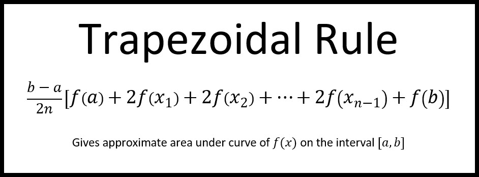
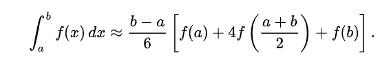
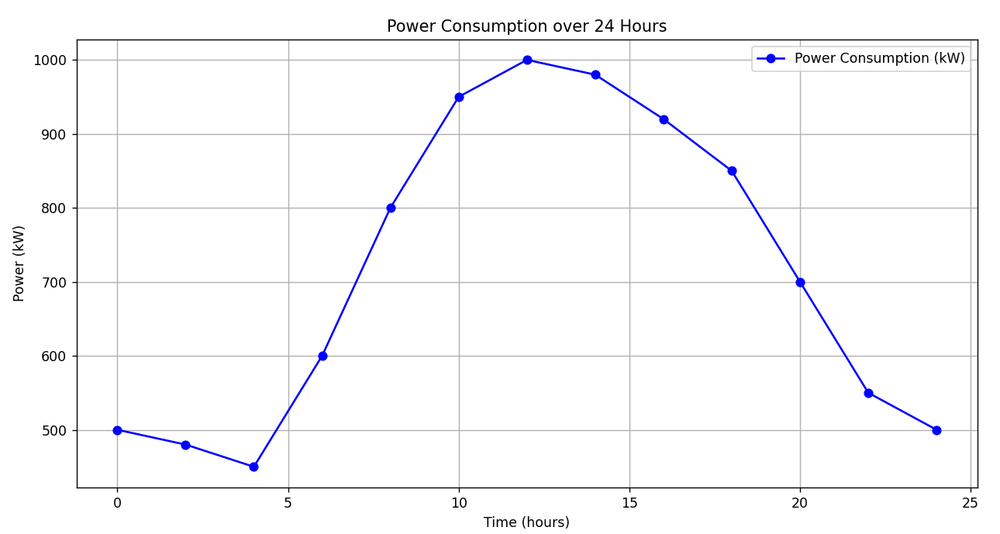

# Energy Consumption Calculation Report

## 1. Overview
This report presents the calculation of total energy consumption using two numerical integration methods: the Trapezoidal Rule and Simpson’s Rule. The goal is to determine the total energy consumed over 24 hours based on given power consumption data.

## 2. Data Description
| Time (hours) | Power (kW) |
|--------------|------------|
| 0            | 500        |
| 2            | 480        |
| 4            | 450        |
| 6            | 600        |
| 8            | 800        |
| 10           | 950        |
| 12           | 1000       |
| 14           | 980        |
| 16           | 920        |
| 18           | 850        |
| 20           | 700        |
| 22           | 550        |
| 24           | 500        |

## 3. Methodology
    Two numerical integration methods were used to calculate the total energy consumption:
1. **Trapezoidal Rule** – Approximates the area under the curve using trapezoids.
2. **Simpson’s Rule** – Approximates the area using parabolic segments for higher accuracy.

The calculations were performed using the following formulas:

- **Trapezoidal Rule:**  
  

- **Simpson’s Rule:**  
  

## 4. Results
| Method            | Total Energy Consumption (MWh) |
|-------------------|-------------------------------|
| Trapezoidal Rule  | 17560.00                         |
| Simpson's Rule    | 17586.67                        |

### Power Consumption over 24 hours
  

## 5. Conclusion and Recommendations
- **Simpson’s Rule** is the preferred method for calculating total energy consumption due to its higher accuracy, especially for nonlinear data.
- The difference between the two methods is relatively small, but Simpson's rule consistently provides a more precise result.
- Future calculations should prioritize using Simpson’s Rule for improved accuracy in energy consumption estimation.

